# EE 577A Lab 2 

1. **Timing Parameters Characterization**  
   - Simulate a transistor-level **NAND gate** (Cell Under Study, CUS).  
   - Measure input/output rise and fall times, delays, and load capacitance effects.  
   - Use MATLAB for **linear regression** to model worst-case delay vs. load capacitance.  

2. **Decoder Design Exploration & Optimization**  
   - Design a **4-to-16 decoder** using logic gates (NAND, NOR, INV).  
   - Compare two designs.  
   - Simulate correctness & worst-case delay in **Cadence** using GPDK 45nm library.  

## 2-Input NAND Gate

### Schematic & Testbench
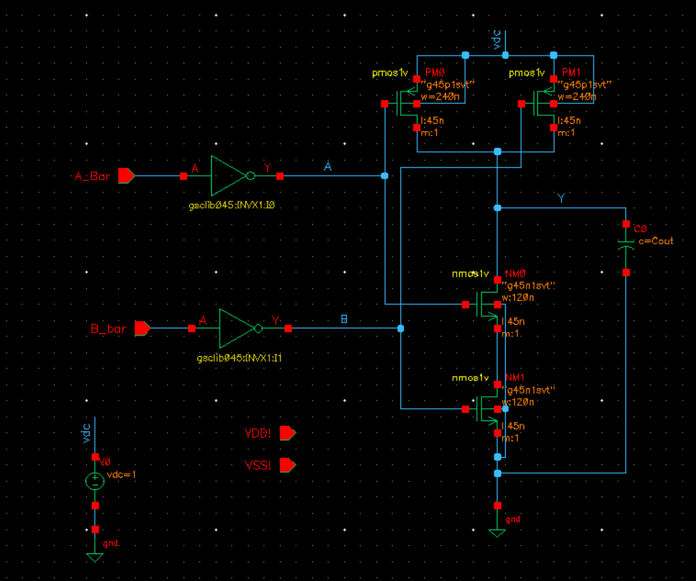
### Cadence ADE Setup
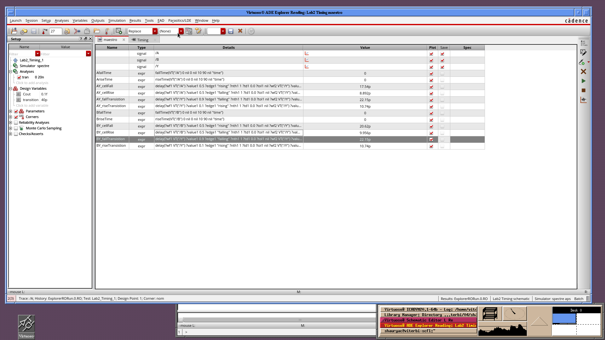
### Waveforms
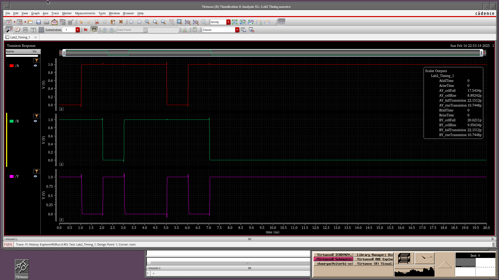

Results are stored in [CapSweep_NAND CSV file]( NAND2_DelayAnalysis/CapSweep_NAND.csv) 

### Extracting Delay Function
Linear regression formula for worst-case rising: 
$$
Delay = 0.000000000008604 * CapOut + 0.000000000009328
$$

Linear regression formula for worst-case falling: 
$$
Delay = 0.000000000023085 * CapOut + 0.000000000018595
$$

### Linear Regression
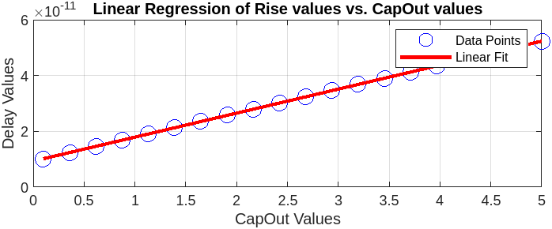

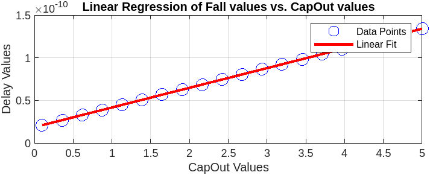

--- 

## **PART 2: DECODER DESIGN EXPLORATION**  

Now, we will design a **4-to-16 decoder** using the **GPDK045 (45nm) technology library** 

A **4-to-16 decoder** takes **4 inputs** and generates **16 unique output lines**, activating only one output at a time.  

#### **Truth Table for a 4-to-16 Decoder**
| A3 | A2 | A1 | A0 | Output |
|----|----|----|----|--------|
|  0 |  0 |  0 |  0 | W0 = 1 |
|  0 |  0 |  0 |  1 | W1 = 1 |
|  0 |  0 |  1 |  0 | W2 = 1 |
|  ... | ... | ... | ... | ... |
|  1 |  1 |  1 |  1 | W15 = 1 |

---

## Choosing Gate-Level Designs 
We need to explore **two designs**:  

**D1: Minimum Transistor Count Design**  
   - Uses **NAND, NOR, and NOT gates** efficiently.  
   - Focuses on minimizing logic depth and transistor count.  

**D2: Low-Delay Optimized Design**  
   - Uses **faster logic** (e.g., **pre-decoding, parallel NOR/NAND optimizations**).  
   - Reduces gate **fan-in** to improve timing performance.  

---

## **Design D1: Minimum Transistor Count Design**
**Goal**: Minimize the number of transistors by using an **optimized logic structure** with minimal gate depth.  

### **🔍 Approach for D1**
- **Use a hierarchical NAND/NOR-based structure**  
- **Reduce the number of gates** needed to generate outputs  
- **Minimize fan-in**, as large gates (e.g., NAND4) introduce significant delay  

### **Implementation Strategy**
1. **Generate Inverted Inputs**  
   - Since the minterms involve **both true and complemented inputs**, first create **A̅0, A̅1, A̅2, A̅3** using **4 NOT gates**.  

2. **Use NAND Gates for Minterms**  
   - **NAND gates are preferred over AND gates** (since NAND is easier to implement in CMOS).  
   - Each minterm is implemented using a **4-input NAND gate + a NOT gate**.  
   - Example:  
        $$
            W_0 = \text{NAND}(\overline{A3}, \overline{A2}, \overline{A1}, \overline{A0})
        $$

        $$
            W_0 = \text{NOT}(\text{NAND}(\overline{A3}, \overline{A2}, \overline{A1}, \overline{A0}))
        $$

   - A total of **16 4-Input NAND gates + 16 NOT gates** are needed.  

### **Pros of D1**
✔ **Minimal transistor count** (NAND + NOT is transistor-efficient)  
✔ **Low power consumption** due to reduced switching activity  

### **Cons of D1**
✘ **Higher propagation delay** (NAND followed by NOT adds extra delay)  
✘ **Possible signal degradation** if fan-out is large  

---

## **Design D2: Low-Delay Optimized Design**  
**Goal**: Reduce delay by minimizing gate depth and optimizing signal propagation.  

### **Approach for D2**
- **Use a pre-decoding strategy** to reduce the complexity of individual minterms.  
- **Implementing two-stage decoding** can significantly improve delay.  

To **efficiently design a 4:16 decoder**, we use a **pre-decoding stage** with **two 2:4 decoders**, reducing logic complexity and delay.  

---

### **1. Concept of Pre-Decoding**
Instead of using a **single large 4-input AND gate tree**, we first **decode the two MSBs (A, B) using a 2:4 decoder**, and then use the outputs of this stage along with the **LSBs (C, D) to enable the final decoding**.  

**Advantages of Pre-Decoding:**  
✅ **Reduces gate count** by breaking decoding into hierarchical stages.  
✅ **Minimizes delay** since smaller decoders have shorter critical paths.  
✅ **Scalability**—this approach is used in large decoders (e.g., 5:32, 6:64).  

### **3. Block Diagram Approach**
The **4-input decoder** can be broken down into:  
1. **Stage 1: 2:4 Decoder (Pre-Decoding)**
   - Inputs: **A, B**  
   - Outputs: **Y0, Y1, Y2, Y3** (4 signals corresponding to AB = 00, 01, 10, 11)  

2. **Stage 2: 2:4 Decoder (Final Decoding)**
   - Inputs: **C, D**  
   - Outputs: **Z0, Z1, Z2, Z3** (4 signals corresponding to CD = 00, 01, 10, 11)  

3. **Final Stage: AND Gates for 4:16 Decoding**
   - **Combine outputs from Stage 1 and Stage 2** using **AND gates**.  
   - Each **final output = (Yi AND Zj)** to generate **16 unique outputs (w0–w15)**.  

---

### **4. Logic Implementation**
#### **(a) First 2:4 Decoder (Pre-Decoding A, B)**
The outputs are:  
$$
Y_0 = \bar{A} \bar{B}, \quad Y_1 = \bar{A} B, \quad Y_2 = A \bar{B}, \quad Y_3 = A B
$$

#### **(b) Second 2:4 Decoder (Decoding C, D)**
The outputs are:  
$$
Z_0 = \bar{C} \bar{D}, \quad Z_1 = \bar{C} D, \quad Z_2 = C \bar{D}, \quad Z_3 = C D
$$

#### **(c) Final AND Logic for 4:16 Decoding**
Each **final output (w0–w15)** is generated by:  
$$
w_{i} = Y_j \cdot Z_k
$$
where **j = (A, B)** decoding and **k = (C, D)** decoding.

$$
\begin{aligned}
w_0 &= Y_0 \cdot Z_0 = (\bar{A} \bar{B}) \cdot (\bar{C} \bar{D}) \\
w_1 &= Y_0 \cdot Z_1 = (\bar{A} \bar{B}) \cdot (\bar{C} D) \\
w_2 &= Y_0 \cdot Z_2 = (\bar{A} \bar{B}) \cdot (C \bar{D}) \\
w_3 &= Y_0 \cdot Z_3 = (\bar{A} \bar{B}) \cdot (C D) \\
w_4 &= Y_1 \cdot Z_0 = (\bar{A} B) \cdot (\bar{C} \bar{D}) \\
&\vdots \\
w_{15} &= Y_3 \cdot Z_3 = (A B) \cdot (C D)
\end{aligned}
$$

---

### **6. Advantages of This Approach**
✅ **Faster than direct 4:16 decoding** due to pre-decoding.  
✅ **Less gate count**, reducing **area and power consumption**.  
✅ **Modular Design**: The same method can be **scaled for larger decoders** (e.g., 5:32).  

---

## **Our Intuition**
Using a **2-stage 2:4 pre-decoding strategy**, we significantly **optimize** the design.  
- **Pre-decoding splits complexity, reducing delay.**  
- **AND gates combine partial results for final outputs.**  

### **Comparison of D1 vs. D2**
| Feature  | **D1 (Min Transistor Count)** | **D2 (Low-Delay Optimized)** |
|----------|------------------------------|------------------------------|
| **Logic Depth** | 2 levels (NAND + NOT) | 4 levels (Pre-decode(NAND2+INV) + NAND + INV) |
| **Delay** | Higher | Lower |
| **Power** | Lower | Higher |
| **Transistor Count** | Lower | Higher |
| **Fan-in per gate** | High (NAND4) | Lower due to pre-decoding |

---

## Cadence Verification and Simulation

### **Design D1**
### D1 Schematic
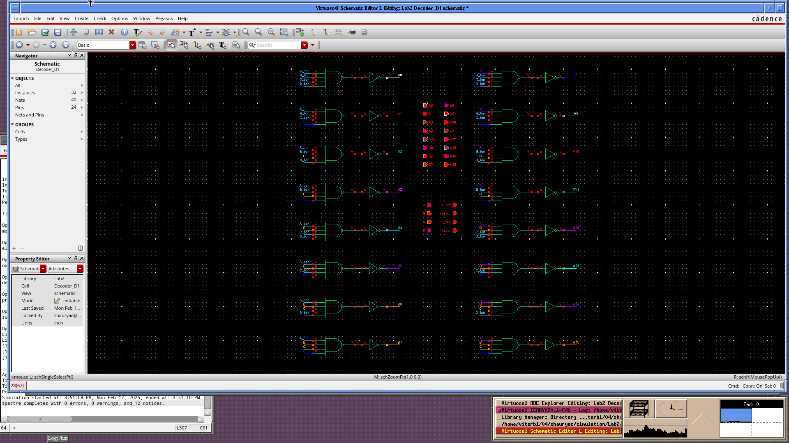
### D1 Testbench
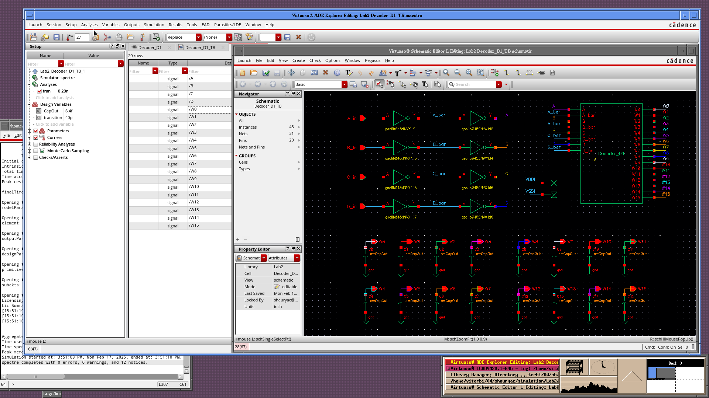
### D1 Exhaustive Logic Verification
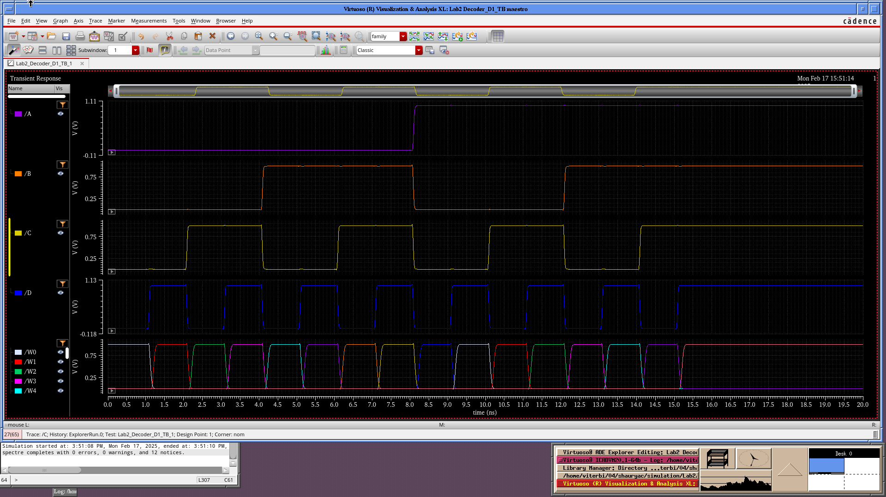
### D1 Worst Case Scenario for W0
Test Vector1: 1010 -> 0000

Delay: 108.1p

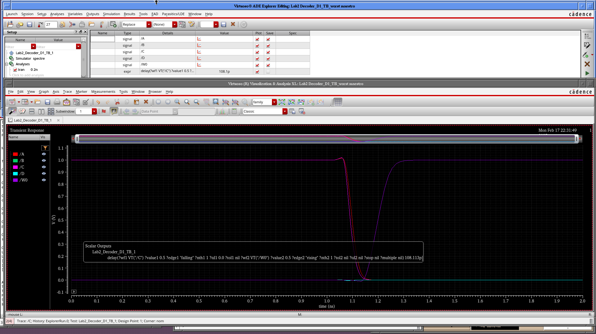

Test Vector2: 1100 -> 0000

Delay: 109.7p

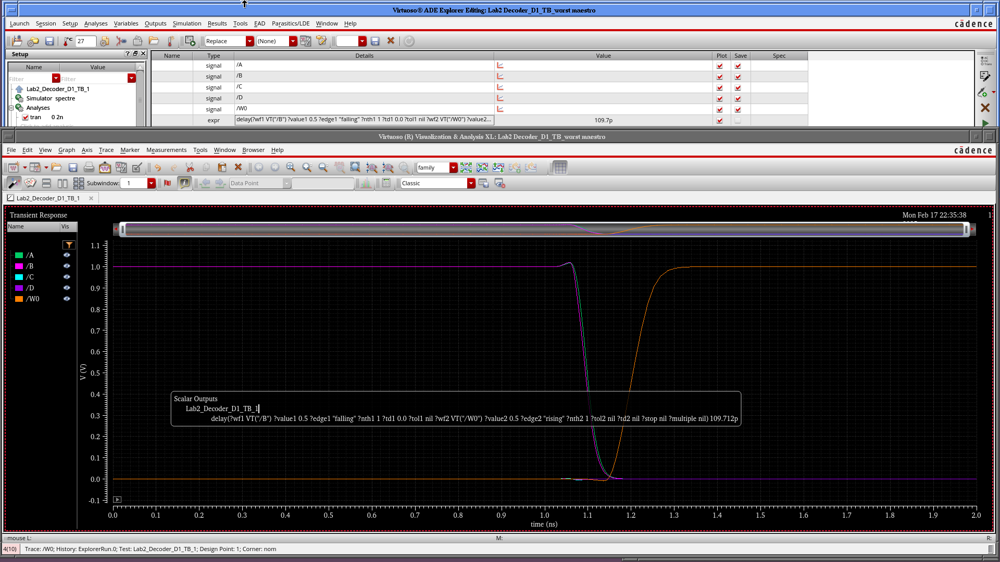

---

### **Design D2**
### D2 Schematic
**2-Input Decoder**

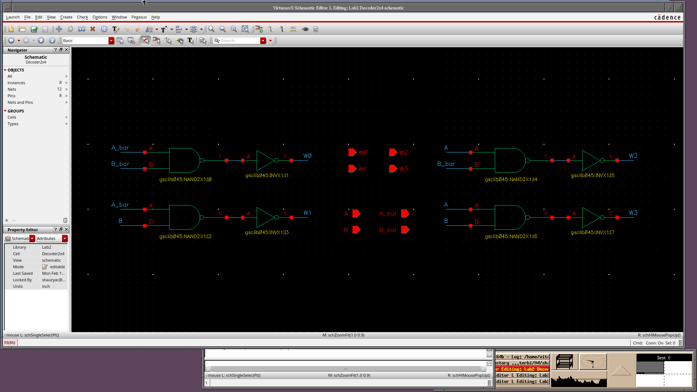

Decoder_D2
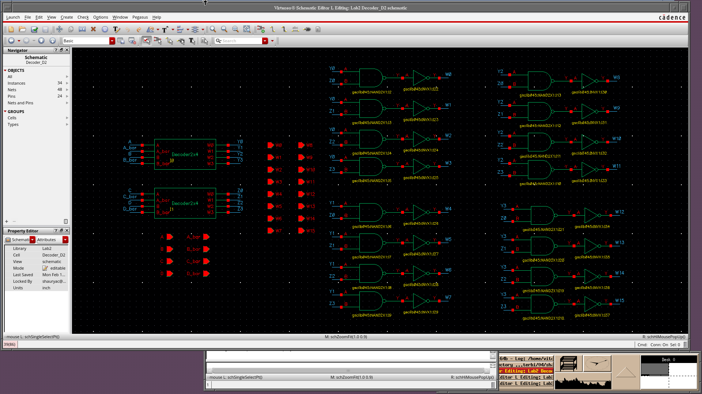

### D2 Testbench
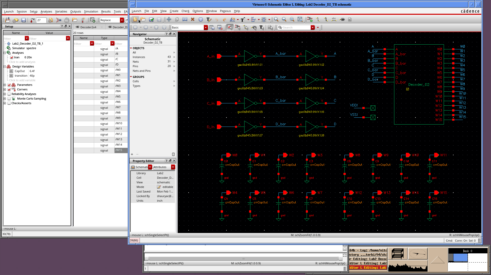
### D2 Exhaustive Logic Verification
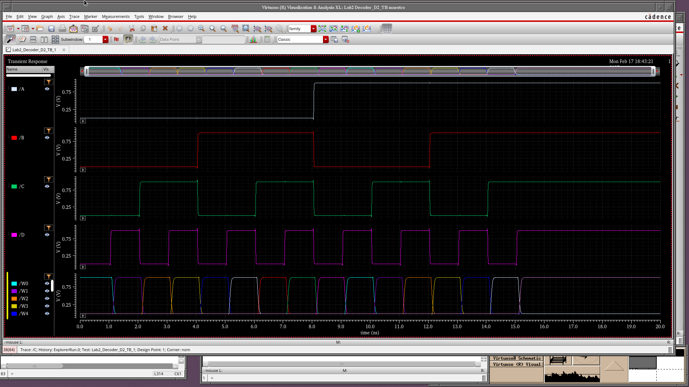
### D2 Worst Case Scenario for W0
Test Vector1: 1010 -> 0000

Delay: 110.7p

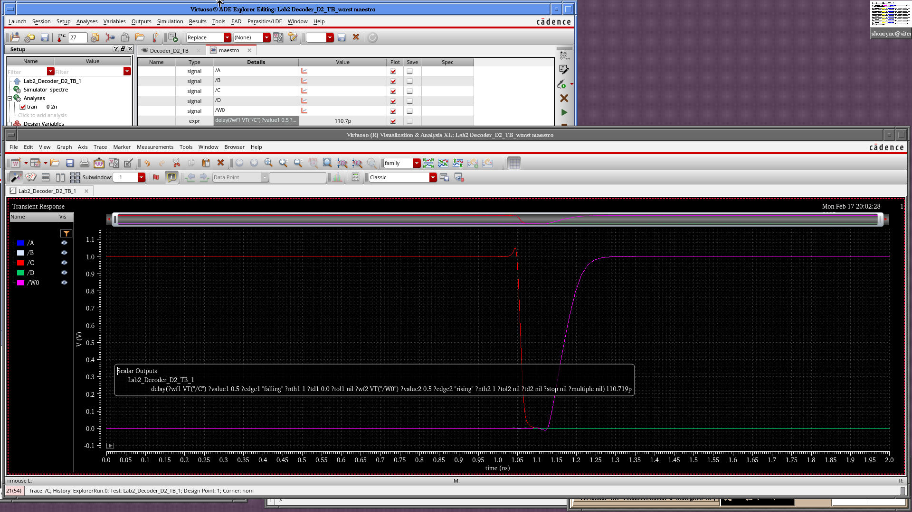

Test Vector2: 1100 -> 0000

Delay: 113.6p

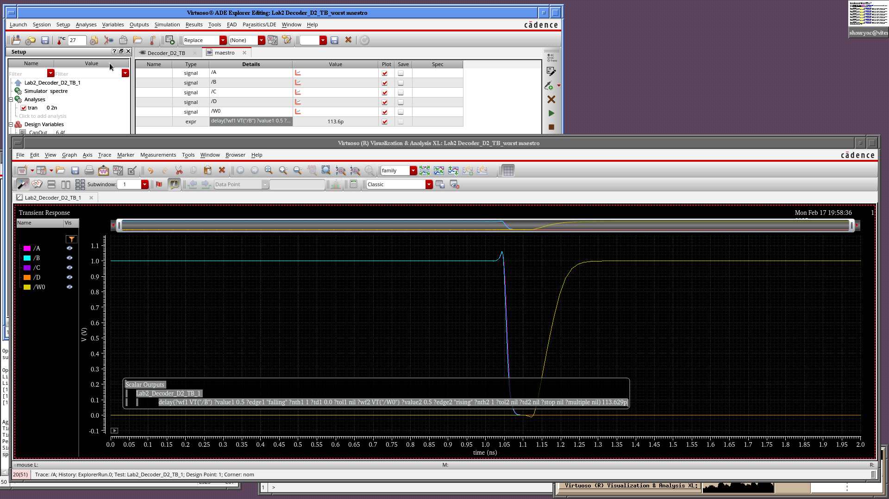

## Simulation Result Analysis
This discrepancy between our intuition and simulation results could be due to several factors. Let’s analyze the possible reasons.

### **1. Increased Gate Loading in Design D2**
- Since **Design D2** uses a **pre-decoding stage (2:4 decoders + NAND2 gates)**, each **decoder output** drives multiple NAND gates.
- This increases **fan-out** and **capacitive loading**, slowing down the signal propagation.

### **2. Drive Strength of NAND2 Gates**
- Are the **NAND2 gates properly sized**? If they are weak (lower drive strength), they may have a higher transition time than expected.
- Consider upsizing critical NAND2 gates in **Design D2** to match the performance of the single 4-input NAND in **Design D1**.

---

### **Next Steps**

1. **Perform gate sizing analysis**:
   - Try increasing the drive strength of the NAND2 gates.

2. **Compare logical effort calculations with extracted parasitics**:
   - The pre-decoder should reduce logical effort in an ideal case, but parasitics may introduce unexpected delay.

### Design Changes

**The NAND2x1 Gates of 2:4 Decoder in D2 are sized up to NAND2x2**

### Decoder D2 Re-Run Simulation
Test Vector1: 1010 -> 0000
Delay: 102.4p

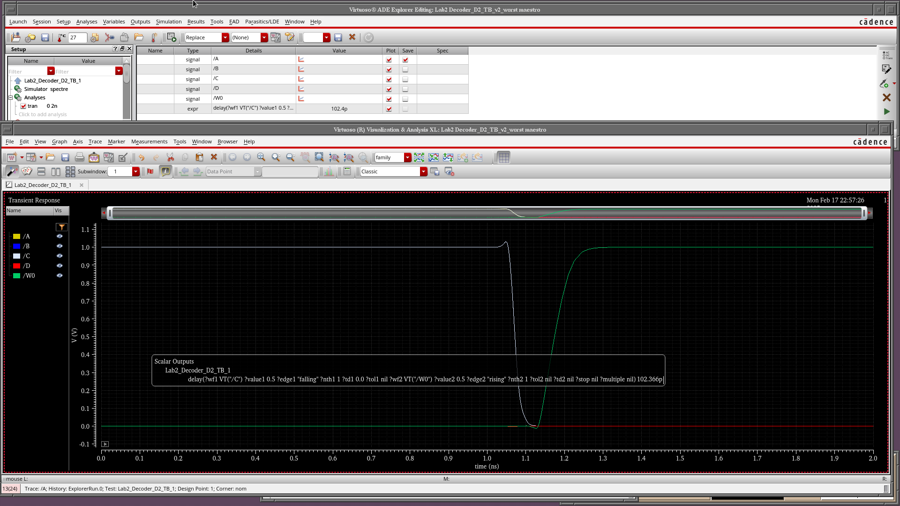

## Conclusion
Sizing up the **NAND2x1** gates to **NAND2x2** has improved the delay for **Design D2**, reducing it from **110.7p to 102.4p** for the worst-case rising edge.  

### **Observations & Key Takeaways**
1. **Why did sizing up NAND2 gates help?**  
   - Larger transistors reduce **resistance (R)** and improve drive strength.
   - This speeds up transitions, reducing propagation delay.
   - However, excessive upsizing could increase **input capacitance**, which might affect earlier stages.

2. **Does D2 now outperform D1?**
   - Your earlier **D1 delay: 108.1p**  
   - **New D2 delay: 102.4p** (improvement over both D1 and previous D2)
   - Now, **D2 is finally better than D1**, aligning with theoretical expectations.

3. **Further Optimizations to Consider**
   - **Buffer insertion**: If any nets have high fan-out, inserting **inverters or buffers** could improve performance.
   - **Load balancing in the pre-decoder**: Check if any output nodes are still slower than others.
   - **Parasitic extraction**: If running post-layout sims, further tweaks might be needed to minimize wiring delays.

### Why D2 with Pre-Decoding is better?
1. Less Capacitance.
2. We saved a lot of area by "sharing" gates.
3. We can "Pitch Fit" 2-input NAND gates during layout
