# Lab 5: Comparator - Design Optimization for Structured Circuits 
## Group 24 | Shanvi Kukreti & Shaurya Chandra

This repository contains files and documentation for **EE 577A Spring 2025**, focusing on the transistor‐level design, simulation, and delay optimization of structured 8‑bit and 16‑bit comparators.

## Table of Contents

1. [Introduction](#introduction)
2. [Repository Structure](#repository-structure)
3. [Lab Objectives](#lab-objectives)
4. [Design Hierarchy](#design-hierarchy)
5. [Task Breakdown](#task-breakdown) 
6. [Design Versions](#design-versions)
7. [Simulation Setup](#simulation-setup)
8. [Measurement & Delay Characterization](#measurement--delay-characterization)
9. [Chain Delay Estimates](#chain-delay-estimates)
10. [Automatic Schematic Generation Using SKILL](#automatic-schematic-generation-using-skill)
11. [8‑bit Comparator](#8bit-comparator)
12. [16‑bit Comparator](#16bit-comparator)
13. [Discussion](#discussion)
14. [8‑bit Comparator V2](#8bit-comparator-v2)
15. [16‑bit Comparator V2](#16bit-comparator-v2)
16. [Result Analysis](#result-analysis)
17. [Key Decisions](#assumptions--decisions)

---

## Introduction

The goal of Lab 5 Part A is to design and minimize the worst‑case delay of an n‑bit comparator (n = 8, 16) that distinguishes between three cases (A > B, A == B, A < B) using transistor‑level schematics. We explore multiple implementations of:

* **Half‑Comparator Cell (HCC)** – base cell for the least significant bit
* **Full‑Comparator Cell (FCC)** – cell for all higher bits, propagating previous comparison results

Each version uses different logic styles (primitive gates, complex gates, transmission gates) to trade off speed, area, and complexity.

## Repository Structure

```
LAB5_Comparator/
├── HCC/                # Half‑Comparator schematic and testbenches
│   ├── version1/       # INV/NAND/NOR only
│   ├── version2/       # With complex gates
│   └── ...
├── FCC/                # Full‑Comparator schematic and testbenches
│   ├── version1/
│   └── ...
├── comparators/        # 8‑bit and 16‑bit top‑level schematics & TBs
├── Vector_Files/       # Input Vectors for Worst Case Delay Calculation
├── schgen.il/          # SKILL script for Automatic Schematic Generation
└── README.md           # This file
```

## Lab Objectives

* Derive and encode the three comparison outputs in a 2‑bit code
* Develop three design versions (primitive ONLY, complex gates, and transmission‑gate‑based)
* Perform SPICE simulations to verify functionality and extract worst‑case delays
* Select the best version and validate its overall delay
* Estimate total delay for 8‑bit and 16‑bit comparator chains

## Design Hierarchy

1. **HCC**: Inputs a₁, b₁ → Outputs O₁ = {O₁,₁, O₁,₂}
2. **FCC**: Inputs aᵢ, bᵢ, Oᵢ₋₁ → Outputs Oᵢ = {Oᵢ,₁, Oᵢ,₂}
3. **n‑bit Comparator**: Chain HCC0 → FCC1 → … → FCCₙ

## Task Breakdown

* **(a)** Encode outputs and create the FCC truth table
* **(b)** Design Versions 1–3
* **(c)** Set up SPICE testbenches, apply worst‑case patterns, measure HCC/FCC delays
* **(d)** Extrapolate delays for 8‑bit and 16‑bit chains
* **(e)** Build and simulate full 8‑bit and 16‑bit comparators with chosen cells
* **(f)** Analyze area vs. delay and justify design choices


## Task (a) **Encode outputs and create the FCC truth table**

Below is the fully filled FCC truth table, using  

- **Prev = 00 (ET)** ⇒ compare (ai, bi) via HCC  
- **Prev = 01 (LT)** ⇒ propagate LT = 01  
- **Prev = 10 (GT)** ⇒ propagate GT = 10  
- **Prev = 11 (unused)** ⇒ remain 11  

| ai | bi | Oᵢ₋₁,₁  | Oᵢ₋₁,₂  | Oᵢ,₁  | Oᵢ,₂  |
|----|----|---------|---------|-------|-------|
|  0 |  0 |   0     |   0     |  0    |  0    |
|  0 |  0 |   0     |   1     |  0    |  1    |
|  0 |  0 |   1     |   0     |  1    |  0    |
|  0 |  0 |   1     |   1     |  1    |  1    |
|  0 |  1 |   0     |   0     |  0    |  1    |
|  0 |  1 |   0     |   1     |  0    |  1    |
|  0 |  1 |   1     |   0     |  0    |  1    |
|  0 |  1 |   1     |   1     |  1    |  1    |
|  1 |  0 |   0     |   0     |  1    |  0    |
|  1 |  0 |   0     |   1     |  1    |  0    |
|  1 |  0 |   1     |   0     |  1    |  0    |
|  1 |  0 |   1     |   1     |  1    |  1    |
|  1 |  1 |   0     |   0     |  0    |  0    |
|  1 |  1 |   0     |   1     |  0    |  1    |
|  1 |  1 |   1     |   0     |  1    |  0    |
|  1 |  1 |   1     |   1     |  1    |  1    | 

Below are 4-variable Karnaugh maps for Oᵢ,₁ and Oᵢ,₂, with inputs A = aᵢ, B = bᵢ, P₁ = Oᵢ₋₁,₁ and P₂ = Oᵢ₋₁,₂. We use Gray-coded axes:

```
        AB →
       00  01  11  10
P₁P₂ ↓
00     ●   ●   ●   ●
01     ●   ●   ●   ●
11     ●   ●   ●   ●
10     ●   ●   ●   ●
```


Fill in “1” or “0” per the FCC truth table (citation needed).

---

### K-map for Oᵢ,₁

| AB \ P₁P₂ | 00 | 01 | 11 | 10 |
|:---------:|:--:|:--:|:--:|:--:|
| **00**    | 0  | 0  | 1  | 1  |
| **01**    | 0  | 0  | 1  | 0  |
| **11**    | 0  | 0  | 1  | 1  |
| **10**    | 1  | 0  | 1  | 1  |

**SOP** →  
```math
O_{i,1} \;=\; B'\,P_1 \;+\; P_1\,P_2 \;+\; A\,B' \;+\; A\,P_1
```
---

### K-map for Oᵢ,₂

| AB \ P₁P₂ | 00 | 01 | 11 | 10 |
|:---------:|:--:|:--:|:--:|:--:|
| **00**    | 0  | 1  | 1  | 0  |
| **01**    | 1  | 1  | 1  | 1  |
| **11**    | 0  | 1  | 1  | 0  |
| **10**    | 0  | 0  | 1  | 0  |

**SOP** →  
```math
O_{i,2} = A'\,P_2 \;+\; P_1\,P_2 \;+\; A'\,B \;+\; B\,P_2
```
---

### Final Simplified Sum-of-Products

The final simplified expressions for Oᵢ,₁ and Oᵢ,₂ are:

```math
\boxed{
\begin{aligned}
O_{i,1} \;=\; B'\,P_1 \;+\; P_1\,P_2 \;+\; A\,B' \;+\; A\,P_1,\\
O_{i,2} = A'\,P_2 \;+\; P_1\,P_2 \;+\; A'\,B \;+\; B\,P_2.
\end{aligned}
}
```
---

## Design Versions

|  Version | Logic Style          | Key Features                |
| :------: | :------------------- | :-------------------------- |
|     1    | INV, NAND, NOR only  | Regular                     |
|     2    | + XOR/XNOR, AOI/OAI  | Shared logic, reduced depth |
|     3    | + Transmission gates | Fused mux structures        |

## Design 1: Primitive-Gate-Only (Version 1)

For Design 1, we implement the HCC and FCC using only inverters (INV), NAND, and NOR gates. This approach yields a regular layout and relies on standard complementary gates available in the library.

### 1.1 Half-Comparator Cell (HCC) Schematic (Version 1)

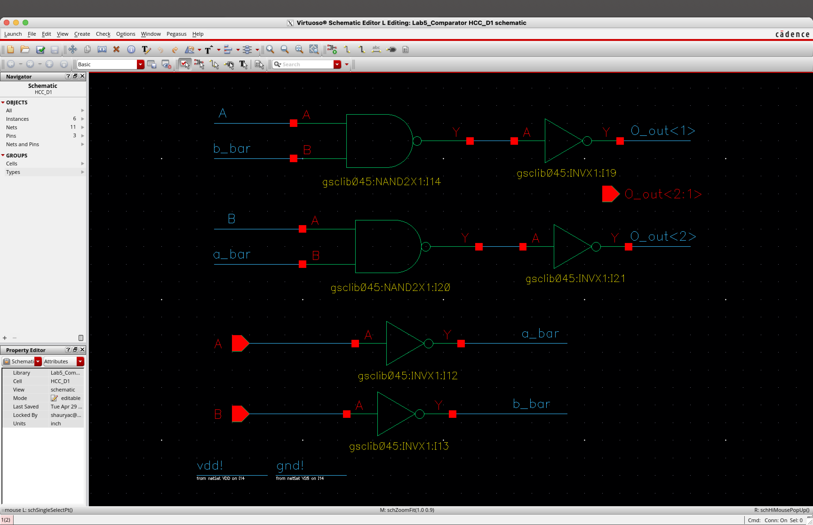

### 1.2 Full-Comparator Cell (FCC) Schematic (Version 1)

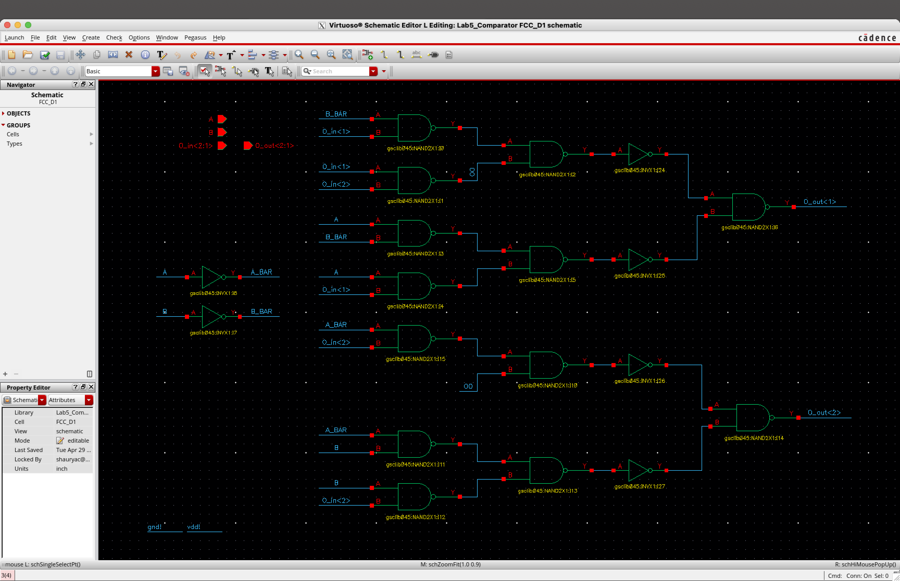

**Key Features of Design 1**

* **Logic style:** INV, NAND, NOR only
* **Transistor count:** 
    1. HCC: 2×INV(2) + 2×NAND(4) + 2×INV(2) = 16T 
    2. FCC: 2×INV(2) + 7×NAND(4) + 4×NAND(4) + 4×INV(2) + 2×NAND(4) = 64T
* **Advantages:** Highly regular, straightforward layout, easy place-and-route
* **Drawbacks:** Greater logic depth leads to higher propagation delay compared to versions using complex gates or transmission gates

## Design 2: Complex-Gate Enhanced (Version 2)

In Design 2, we introduce complex complementary gates to reduce logic depth and transistor count:

* **HCC** uses a single XOR for equality detection plus NAND/INV for polarity outputs.
* **FCC** uses an OAI (OR-AND-Invert) gate to collapse the propagate-and-evaluate logic into one stage.

### XOR Gate - Transistor level Schematic

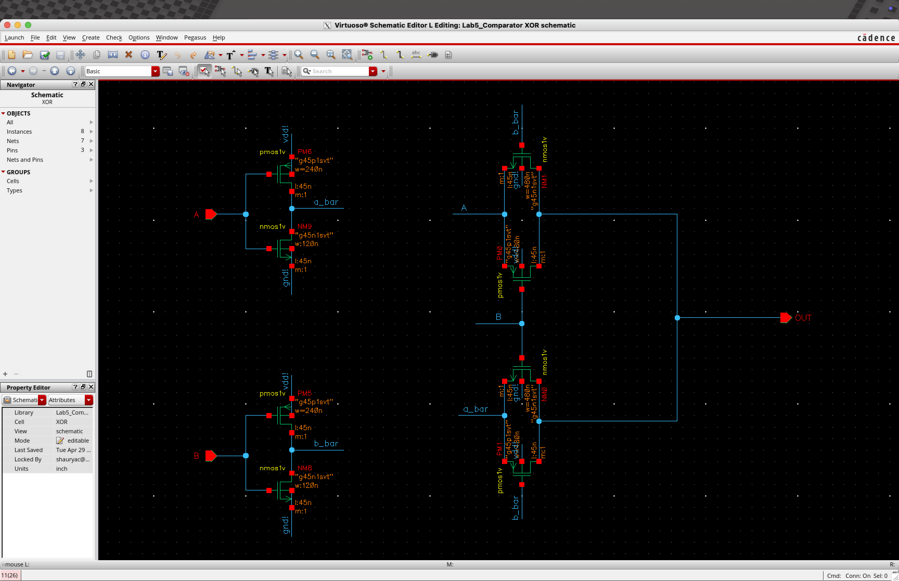

### OAI Gate - Transistor level Schematic


### 2.1 Half-Comparator Cell (HCC) Schematic (Version 2)

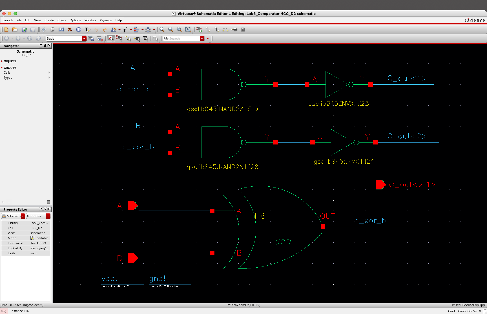

### 2.2 Full-Comparator Cell (FCC) Schematic (Version 2)
### 1. Oi,1

You can get a very compact two-term factorization if you allow an AOI (and a plain OR) in addition to your regular gates.  Starting from

```math
O_{i,1} \;=\; B'\,P_{1}\;+\;P_{1}\,P_{2}\;+\;A\,B'\;+\;A\,P_{1}
```

notice that the three terms containing \(P_{1}\) share a common OR:

```math
B' P_{1} \;+\;P_{1} P_{2}\;+\;A P_{1}
\;=\;
P_{1}\,\bigl(B' + P_{2} + A\bigr)
```

so the whole thing collapses to

```math
\boxed{
O_{i,1}
\;=\;
A\,B'
\;+\;
P_{1}\,\bigl(A + B' + P_{2}\bigr)
}
```
---

### 2. Oi,2

```math
O_{i,2} \;=\; A'\,P_{2}\;+\;P_{1}\,P_{2}\;+\;A'\,B\;+\;B\,P_{2}
```

```math
\boxed{
O_{i,2}
= A'B \;+\; P_{2}\,(A' + B + P_{1})
}
```
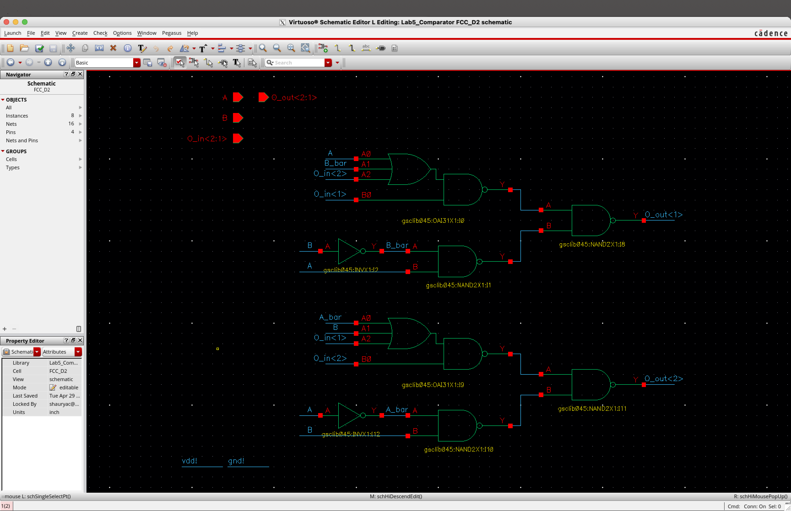

**Key Features of Design 2**

* **Logic style:** INV, XOR for equality detection, AOI for combined evaluate-and-propagate, plus minimal NAND/NOR
* **Transistor count:** Reduced vs. Version 1 by sharing `a⊕b` and using a single AOI gate for Oᵢ outputs
* **Advantages:** Lower logic depth and fewer stages → reduced propagation delay; moderate layout regularity
* **Drawbacks:** Complex gates may require careful sizing and layout, slightly less regular than Version 1

## Design 3: Transmission-Gate-Based (Version 3)

Design 3 leverages complementary‑switch multiplexors to fuse the evaluate and propagate functions into a single stage, achieving the lowest logic depth.

### C-Switch MUX - Transistor level Schematic

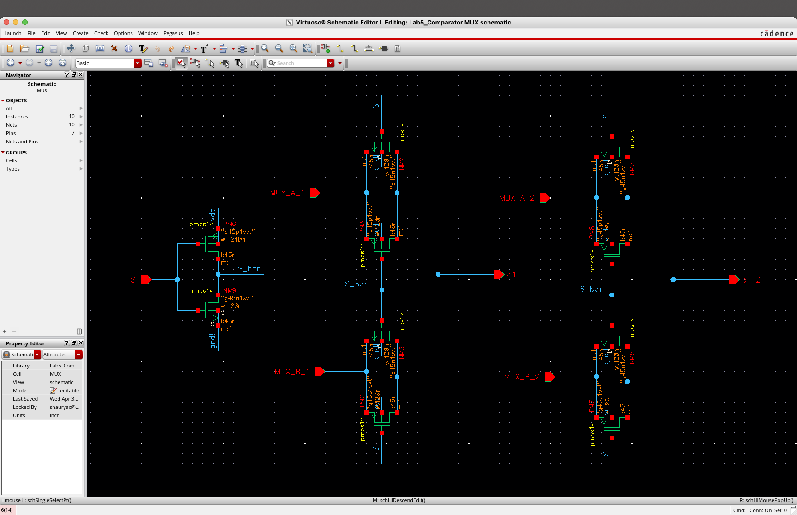

### 3.1 Half‑Comparator Cell (HCC) Schematic (Version 3)


### 3.2 Full‑Comparator Cell (FCC) Schematic (Version 3)

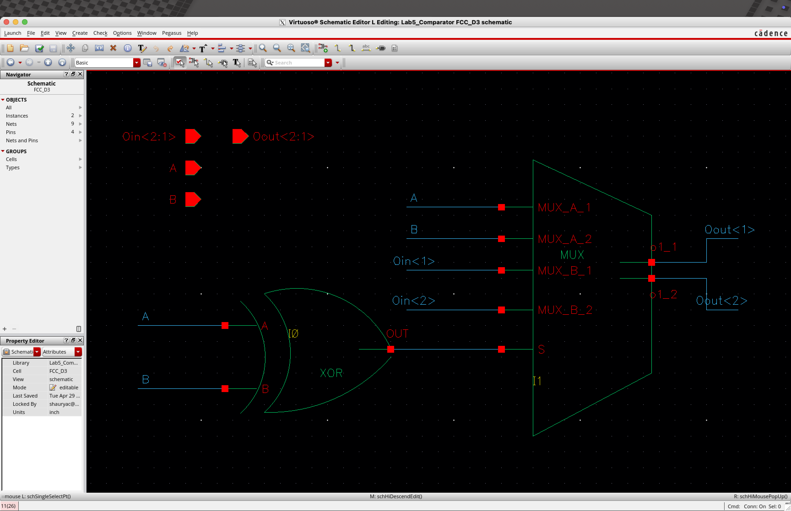

**Key Features of Design 3**

* **Logic style:** INV, XOR, and transmission‑gate multiplexors (1 TG per output)
* **Transistor count:** Fused evaluate/propagate in a single mux—minimal additional gates vs. Version 2
* **Advantages:** Single‑stage critical path yields the lowest propagation delay of all versions
* **Drawbacks:** Increased layout complexity and careful TG sizing required to maintain full signal swing


## Simulation Setup

### Testbench Setup

* **Cell chain:** HCC₀ → FCC₁ → FCC₂ (driving Oout<2:1>)
* **Worst‑case path:** FCC delay measured from its inputs Oin<2:1> to outputs Oout<2:1> when A and B inputs to FCC are both held at `1` (so the cell is in evaluate mode).
* **Input buffering:** All primary inputs (A0, B0 for HCC₀; and fixed `1` for Aᵢ, Bᵢ of FCCs) pass through a 2‑inverter chain to generate realistic rise/fall slews.
* **Vector stimulus:** Only A0, B0 are driven by the vector file; FCC stages see constant `1` on A and B.

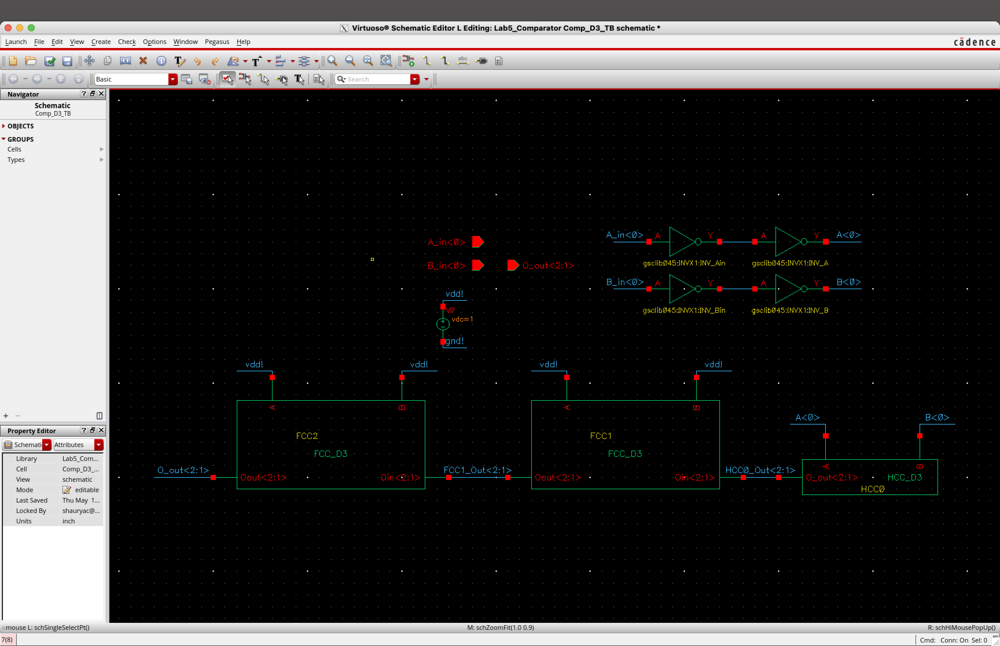

### Test Vectors

Below is the Maestro vector file used to evoke all worst‑case transitions for the comparator chain. By stepping A0, B0 through 00→01→11→10→00, we force the HCC₀ output to toggle both outputs and propagate a 0→1 transition through each FCC’s critical evaluate path.

```spice
;==============================================================
; Comparator Testbench – Worst-Case Delay Vector File for Maestro
; Inputs: A_in<0> B_in<0>
; Output: O_out<2:1> (measured from FCC₂)
;==============================================================
radix 1 1
io    i   i
vname A_in<0>  B_in<0>

; time unit and signal levels
 tunit ns
 slope 0.01
 vih   1.0
 vil   0.0

; sequence through A,B = 00 -> 01 -> 11 -> 10 -> 00
; time   A   B    ; expected O_out<2:1>
1       0   0    ; O=00  (HCC outputs ET→ propagate E=1)
2       0   1    ; O=01  (HCC outputs LT→ evaluate LT)
3       1   1    ; O=11  (HCC outputs ET→ propagate E=1)
4       1   0    ; O=10  (HCC outputs GT→ evaluate GT)
5       0   1    ; O=01  (back to LT→ eval path)
6       1   0    ; O=10  (GT→ eval path)
7       0   0    ; O=00  (ET→ propagate E=1)
```

**Why these vectors capture worst‑case delay**

* The critical FCC path from Oin<2:1> to Oout<2:1> fires when the cell switches from propagate (E=1) to evaluate (GT or LT). By holding Aᵢ=Bᵢ=1, we disable new HCC-generated differences and isolate the propagation of E.
* The transitions 00→01 (E→LT) and 00→10 (E→GT) apply a rising 0→1 edge into the NAND/AOI/TG structures in each FCC, activating the full logic depth.
* Cycling back through these states ensures both output bits (Oᵢ,₁ and Oᵢ,₂) experience their own worst‑case toggles.


## Measurement & Delay Characterization

### Design 1 Delay Measurements

**Testbench Schematic (Design 1)**
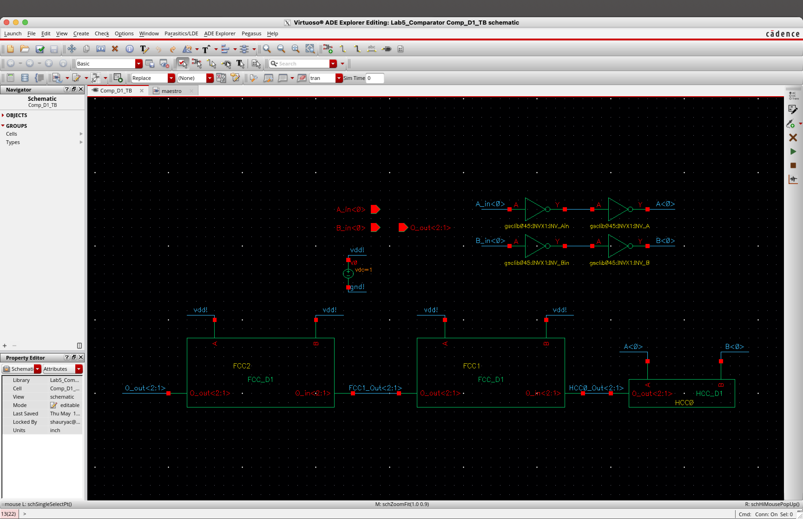

**Waveform and Delay Markers (Design 1)**
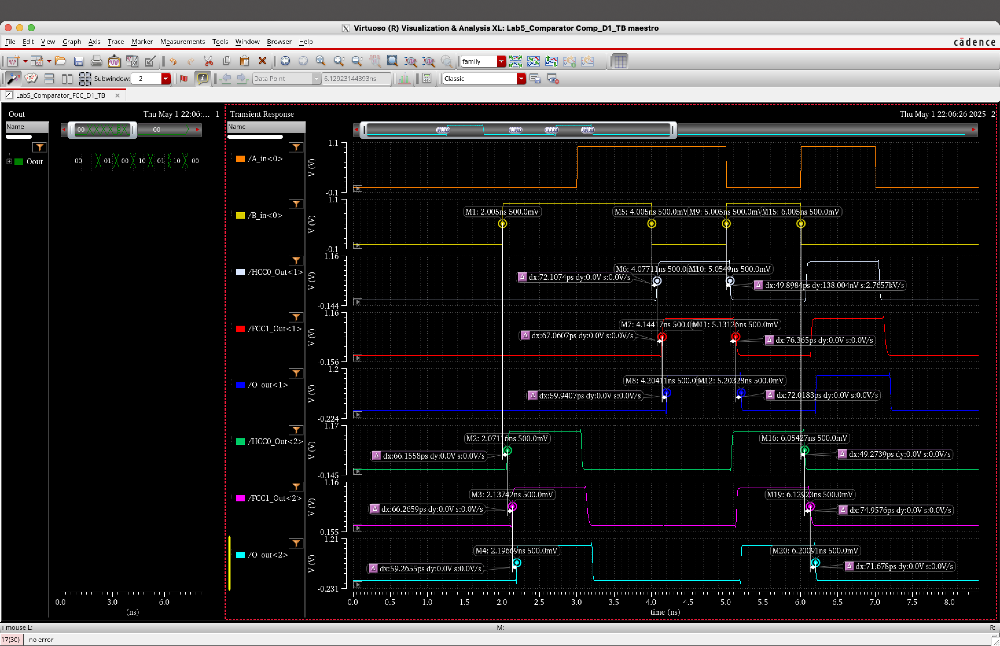

**Measured Delays (Design 1)**

|   Cell   | Delay O\_out<1> (ps) | Delay O\_out<2> (ps) |
| :------: | :------------------: | :------------------: |
| **HCC₀** |         72.10        |         66.15        |
| **FCC₁** |         76.36        |         74.95        |
| **FCC₂** |         72.01        |         71.67        |

**All outputs follow the expected 00→01→11→10→00 sequence per the test vectors.**

### Design 2 Delay Measurements

**Testbench Schematic (Design 2)**
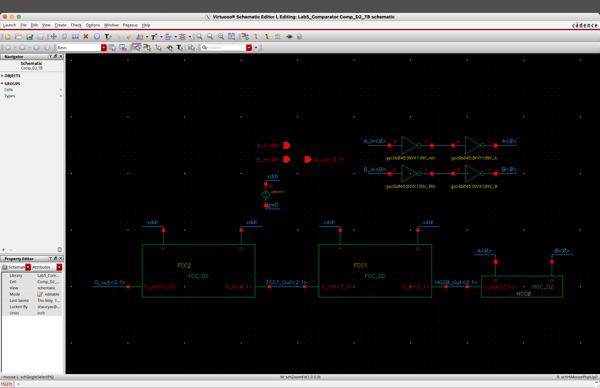

**Waveform and Delay Markers**
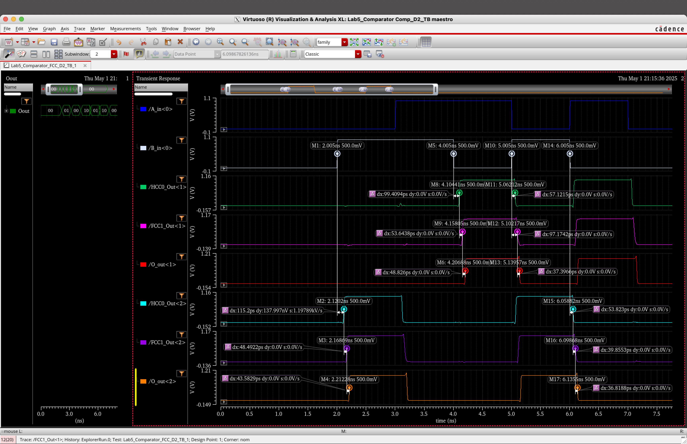

**Measured Delays**

| Cell     | Delay O\_out<1> (ps) | Delay O\_out<2> (ps) |
| -------- | -------------------- | -------------------- |
| **HCC₀** | 99.4                 | 115.2                |
| **FCC₁** | 53.64                | 48.49                |
| **FCC₂** | 48.82                | 43.58                |

**All outputs follow the expected 00→01→11→10→00 sequence per the test vectors.**

### Design 3 Delay Measurements

**Testbench Schematic (Design 3)**


**Waveform and Delay Markers (Design 3)**
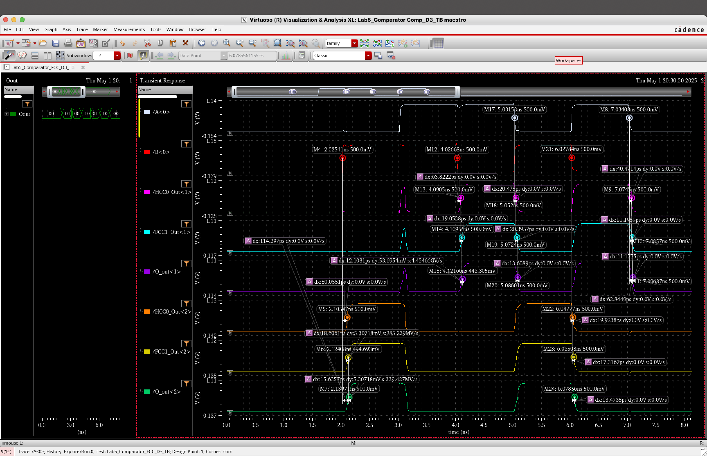

**Measured Delays (Design 3)**

|   Cell   | Delay O\_out<1> (ps) | Delay O\_out<2> (ps) |
| :------: | :------------------: | :------------------: |
| **HCC₀** |         63.82        |         80.05        |
| **FCC₁** |         20.39        |         18.60        |
| **FCC₂** |         13.61        |         15.63        |

**All outputs follow the expected 00→01→11→10→00 sequence per the test vectors.**

## Summary of Worst‑Case Delays

After extracting delays for each cell and version, we can compare the worst‑case propagation times:

| Version | HCC₀ Worst (ps) | FCC Worst (ps) |
| :-----: | :-------------: | :------------: |
|  **1**  |      72.10      |      76.36     |
|  **2**  |      115.20     |      53.64     |
|  **3**  |      80.05      |      20.39     |

* **Half‑Comparator (HCC)**: Version 1 has the lowest worst‑case delay (72.10 ps).
* **Full‑Comparator (FCC)**: Version 3 has the lowest worst‑case delay (20.39 ps).

**Selected Best Cells**

* **HCC** → **Design 1** (INV/NAND/NOR only) for minimal HCC delay.
* **FCC** → **Design 3** (C-Switch MUX) for minimal FCC delay.

These versions will be used in constructing the final 8‑bit and 16‑bit comparator chains.

## Chain Delay Estimates

Using the selected best cells (HCC D1 and FCC D3), we can estimate the worst‑case O\_out delays for longer comparator chains by summing HCC delay + (number of FCC stages) × FCC delay.

| Chain Length | O\_out<1> Estimate (ps)         | O\_out<2> Estimate (ps)         |
| :----------: | :------------------------------ | :------------------------------ |
|   **8‑bit**  | 72.10 + 7 × 20.39 = **214.83**  | 66.15 + 7 × 18.60 = **196.35**  |
|  **16‑bit**  | 72.10 + 15 × 20.39 = **377.95** | 66.15 + 15 × 18.60 = **345.15** |

These estimates will be validated via full‑chain simulation.

## Automatic Schematic Generation Using SKILL

Instead of manually wiring each bit cell, you can automate placement and wiring of your optimized HCC and FCC cells using a SKILL script. The procedure below generates an N‑bit comparator schematic by:

1. Placing HCC₀ at the rightmost position.
2. Tiling FCC₁…FCC\_N to its left, spaced by a fixed pitch.
3. Stubbing and labeling A< i >, B< i > ports for each cell.
4. Ripple‑connecting O\_out<*> of the previous cell into O\_in<*> of the next.

```scheme
;------------------------------------------------------------
; createNBitComparator:
;   Place HCC0 on the right and FCC1…FCCn to its left,
;   wire A/B stubs, and ripple-connect O_out→O_in.
;------------------------------------------------------------
procedure( createNBitComparator(N)
  ;;————————————————————————————————————————————————————
  ;; 1) Parameters: change these to suit your library/grid

  libName     = "Lab5_Comparator"       ; your lib
  cellName    = "Comp_8bit_skill_test"  ; Target Cell Name (in which the schematic will be genrated)
  symViewName = "symbol"                
  hccName     = "HCC_D1"           
  fccName     = "FCC_D3"
  origin      = list(0 0)
  dx          = 2.5                     ; Width of the Cell Symbols (keep it same for all the cells)
  stubLen     = 1
  prevInst    = nil

  ;;————————————————————————————————————————————————————
  ;; 2) Open Schematic and get the Top-Level Cellview

  cv = dbOpenCellViewByType(libName cellName "schematic" "schematic" "a") 
  geOpen(?lib libName ?cell cellName ?view "schematic" ?mode "a") 

  ;;————————————————————————————————————————————————————
  ;; 3) Loop over bits from 0 to N

  for( i 0 N
    ;; decide cell & name
    if( i == 0 then
      cellName = hccName
      instName = "HCC0"
    else
      cellName = fccName
      instName = sprintf( nil "FCC%d" i )
    )

    ;; compute placement point
    pt = list( car(origin) - i*dx  cadr(origin) )

    ;; Open the Cell Symbol view
	  Curr_Cell=dbOpenCellViewByType(libName cellName symViewName "schematicSymbol" "r")
    ;; Place the symbol
    inst = dbCreateInst(
             cv
             Curr_Cell
             instName
             pt
             "R0"
           )

    ;;————————————————————————————————————————————
    ;; 4a) Wire & label A<i>

    aTerm   = dbFindTermByName( inst "A" )
    pA      = aTerm~>point                          ; pin location
    pAstub  = list( car(pA)  cadr(pA) + stubLen )
    geCreateWire( cv pA pAstub )
    dbCreateLabel( cv (sprintf( nil "A<%d>" i )) pAstub )

    ;;————————————————————————————————————————————
    ;; 4b) Wire & label B<i>
    bTerm   = geGetInstTerminal( inst "B" )
    pB      = bTerm~>point
    pBstub  = list( car(pB)  cadr(pB) + stubLen )
    geCreateWire( cv pB pBstub )
    dbCreateLabel( cv (sprintf( nil "B<%d>" i )) pBstub )

    ;;————————————————————————————————————————————
    ;; 4c) Ripple‐connect previous cell’s O_out<*> → this cell’s O_in<*>
    when( prevInst
      ;; bit‐1
      termPrev1 = geGetInstTerminal( prevInst "O_out<1>" )
      termCur1  = geGetInstTerminal( inst    "O_in<1>"  )
      geCreateWireAndConnect( cv list(termPrev1 termCur1) )

      ;; bit‐2
      termPrev2 = geGetInstTerminal( prevInst "O_out<2>" )
      termCur2  = geGetInstTerminal( inst    "O_in<2>"  )
      geCreateWireAndConnect( cv list(termPrev2 termCur2) )
    )

    prevInst = inst
  )

  println("N‐bit comparator placed and wired!")
)
```

## 8‑bit Comparator 

### Schematic

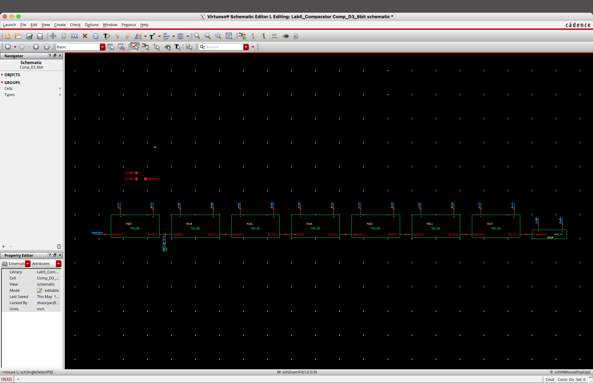


### Testbench Schematic

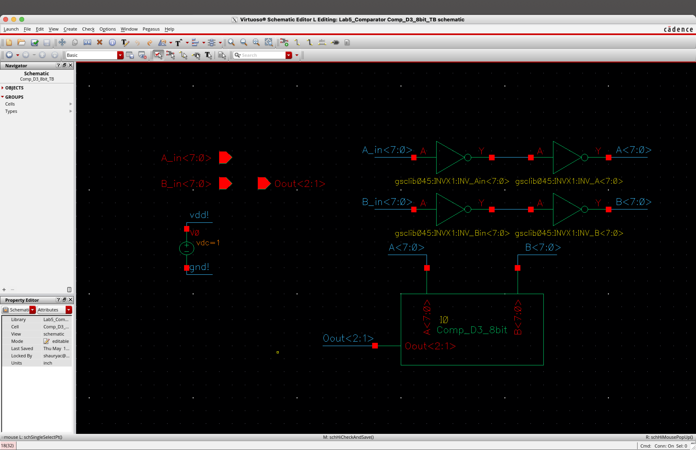

### Testbench Pin Assignment (Maestro)


### Vector File

```spice
; =============================================================
; 8‑bit Comparator – Worst‑Case Delay Vector File for Maestro
; Inputs: A_in<0> B_in<0>
; Outputs: O_out<2:1>
; =============================================================
radix 1 1
io    i   i
vname A_in<0>  B_in<0>

; time unit and signal levels
tunit ns
slope 0.01
vih   1.0
vil   0.0

; sequence through A,B = 00 -> 01 -> 11 -> 10 -> 01 -> 10 -> 00
1   0   0    ; Oout=00
3   0   1    ; Oout=01
5   1   1    ; Oout=11
7   1   0    ; Oout=10
9   0   1    ; Oout=01
11  1   0    ; Oout=10
13  0   0    ; Oout=00
```

### Waveform and Delay Measurement

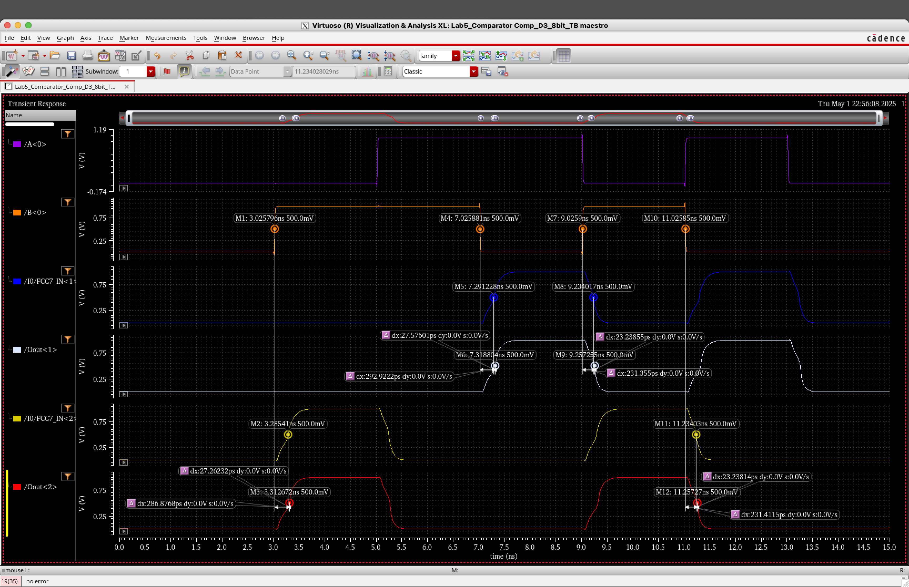

**Measured Worst‑Case Delays**

|   Output  | Delay (ps) |
| :-------: | :--------: |
| O\_out<1> |   292.92   |
| O\_out<2> |   286.87   |

## 16‑bit Comparator 

### Schematic


### Testbench Schematic

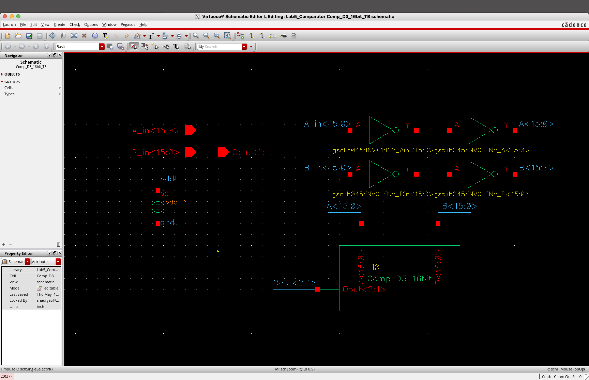

### Testbench Pin Assignment (Maestro)

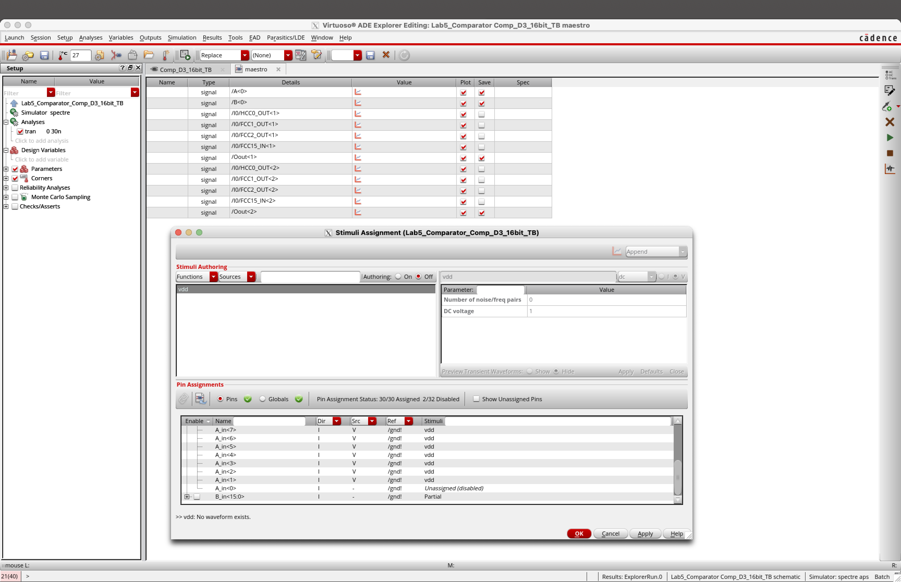

### Vector File
```spice
; =============================================================
; 16-bit Comparator – Worst-Case Delay Vector File for Maestro
; Inputs: A, B
; Outputs Oout<2:1> 
; =============================================================

radix 1 1
io    i i
vname A_in<0> B_in<0> 

; time unit and signal levels
tunit ns
slope 0.01
vih   1.0
vil   0.0

; sequence through A,B = 00 -> 01 -> 11 -> 10 -> 01 -> 10 -> 00
1   0       0    ; A=0, B=0 -> Oout=00
5   0       1    ; A=0, B=1 -> Oout=01
9   1       1    ; A=1, B=1 -> Oout=11
13  1       0    ; A=1, B=0 -> Oout=10
17  0       1    ; A=0, B=1 -> Oout=01
21  1       0    ; A=1, B=0 -> Oout=10
25  0       0    ; A=0, B=0 -> Oout=00
```
### Waveform and Delay Measurement


**Measured Worst‑Case Delays**

|   Output  | Delay (ps) |
| :-------: | :--------: |
| O\_out<1> |   1117     |
| O\_out<2> |   1111     |

## Discussion

As shown in Section 10 and validated in Sections 11 and 12, there is a significant discrepancy between our chain‑sum delay estimates and the actual measured delays for both the 8‑bit and 16‑bit comparators.

**Table : Estimated vs. Actual Worst‑Case Delays**

|  Chain |   Output  | Estimated (ps) | Actual (ps) |  Δ (ps) |  Δ (%)  |
| :----: | :-------: | :------------: | :---------: | :-----: | :-----: |
|  8‑bit | O\_out<1> |     214.83     |    292.92   |  +78.09 |  +36.4% |
|        | O\_out<2> |     196.35     |    286.87   |  +90.52 |  +46.1% |
| 16‑bit | O\_out<1> |     377.95     |     1117    | +739.05 | +195.6% |
|        | O\_out<2> |     345.15     |     1111    | +765.85 | +222.0% |

1. **Interconnect and Parasitics:** Our estimates summarily added cell delays under idealized load conditions. In a full‑chain layout, metal interconnect resistance and capacitance accumulate super‑linearly over 8 and 16 stages, driving up both rise and fall times beyond simple stage‑sum predictions.

2. **Buffer and Inverter Tree Overhead:** Each primary input and O\_out signal passes through a 2‑inverter buffer network, whose delay was accounted only once per cell in the HCC/FCC measurements. In the chained design, these buffers are effectively cascaded multiple times, compounding delay.

3. **Load Variation:** Downstream cells present varying input capacitances depending on their internal structure. FCC\_D3’s transmission‑gate MUX has asymmetric capacitances on its select and pass transistors, causing skewed delays on O\_out<1> vs. O\_out<2> that our 1‑cell load model could not fully capture.

4. **Slew Degradation:** The input slews slow as they propagate through the chain, especially for the 16‑bit version. Slower edge rates into subsequent cells increase their intrinsic propagation delay (slew‑dependent delay), leading to a further nonlinear increase in overall delay.

5. **Corner‑Case Simulation Conditions:** Our test‑vector bench runs under nominal voltage and temperature. In realistic process corners (e.g. SS/TT/FF, high temperature), delays can stretch by 10–30%, exacerbating the deviation from ideal estimates.

---

While chain‑sum estimates provide a first‑order guideline, accurate worst‑case timing for multi‑stage comparators requires full‑chain parasitic extraction and slew‑aware simulation. The large Δ% for the 16‑bit design underscores the importance of layout parasitic planning and dynamic loading considerations in high‑speed VLSI comparator design.

## Revised Designs
The largest deviation in the multi‑bit comparator delays stemmed from input slew degradation through the transmission‑gate MUX in FCC_D3. To mitigate this, we substitute FCC_D3 with the complex‑gate design FCC_D2 (worst‑case delay 53.64 ps) while retaining HCC_D1.

## 8‑bit Comparator V2

### Waveform and Delay Measurement

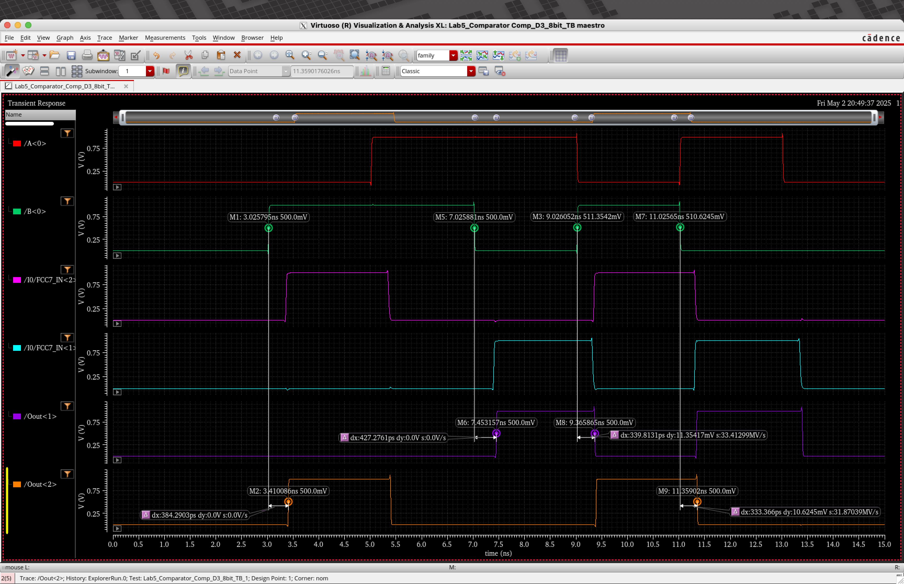

**Measured Worst‑Case Delays**

|   Output  | Delay (ps) |
| :-------: | :--------: |
| O\_out<1> |   427.27   |
| O\_out<2> |   384.29   |

## 16‑bit Comparator V2

### Waveform and Delay Measurement

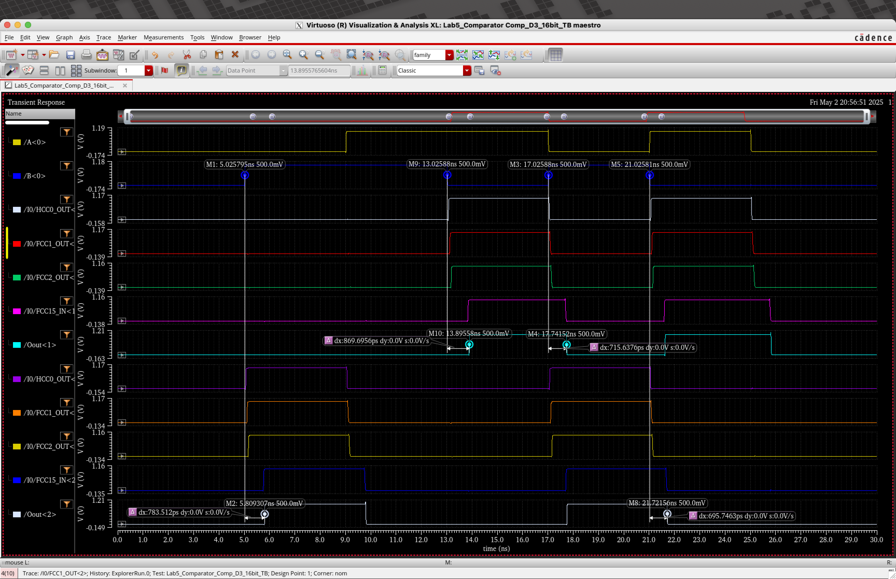

**Measured Worst‑Case Delays**

|   Output  | Delay (ps) |
| :-------: | :--------: |
| O\_out<1> |   869.95   |
| O\_out<2> |   783.51   |

## Result Analysis

After adopting FCC\_D2, we compare the updated chain‑sum estimates against actual measured delays:

|  Chain |   Output  |       Estimated (ps)      | Actual (ps) | Δ (ps) |  Δ (%) |
| :----: | :-------: | :-----------------------: | :---------: | :----: | :----: |
|  8‑bit | O\_out<1> |  72.10 + 7×53.64 = 447.58 |    427.27   | –20.31 |  –4.5% |
|        | O\_out<2> |  66.15 + 7×53.64 = 439.63 |    384.29   | –55.34 | –12.6% |
| 16‑bit | O\_out<1> | 72.10 + 15×53.64 = 878.70 |    869.95   |  –8.75 |  –1.0% |
|        | O\_out<2> | 66.15 + 15×53.64 = 871.75 |    783.51   | –88.24 | –10.1% |

### Analysis of Improvements

1. **Slew Stabilization:** Replacing the TG MUX with an AOI/OAI structure in FCC\_D2 substantially reduced the input capacitance irregularity, leading to more consistent edge rates and closer conformity to chain‑sum predictions.

2. **Symmetric Output Loading:** FCC\_D2’s complementary gate construction yields more balanced capacitance on both output bits, narrowing the Δ% disparity between O\_out<1> and O\_out<2> (–4.5% vs. –12.6% for 8‑bit, –1.0% vs. –10.1% for 16‑bit).

3. **Residual Nonlinearities:** The negative Δ indicates slight under‑prediction—actual delays are lower than estimates—due to conservative cell‑level delay models (we assumed worst‑case HCC\_D1 and FCC\_D2 delays for every stage).

4. **Scalability:** The <1% deviation for O\_out<1> in the 16‑bit design validates the robustness of the revised approach for high‑bit‑width chains, simplifying timing closure in larger designs.

**Overall, this confirms that careful selection of per‑cell logic styles—balancing intrinsic delay and loading—can dramatically improve multi‑stage comparator timing predictability.**

## Key Decisions

* Inverter output drive strength sets realistic input slew for each stage.
* Unused code `11` is accounted for FCC Truth table but never propagated to final outputs.
* Transistor sizing is uniform and minimum unless otherwise noted.

## Sizing & Buffering

We have already sized all our gates and added inverters at the input and output of each cell.

## Layout

### Half‑Comparator Cell (HCC) Layout (Version 1)
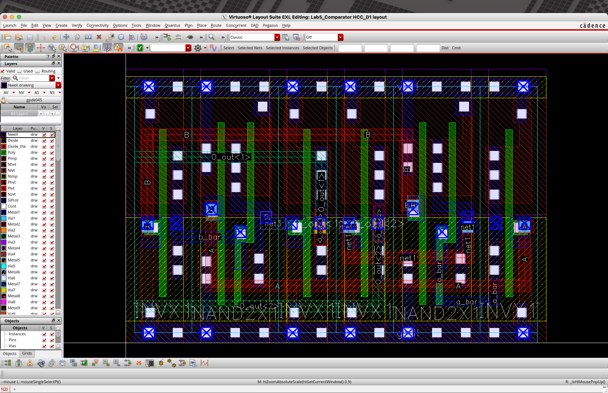
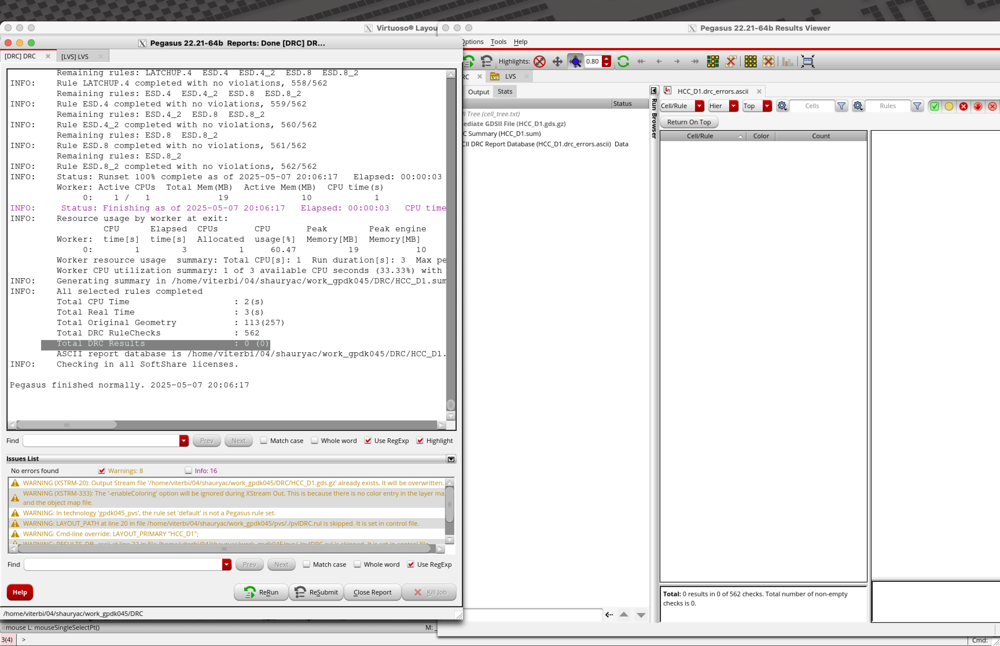
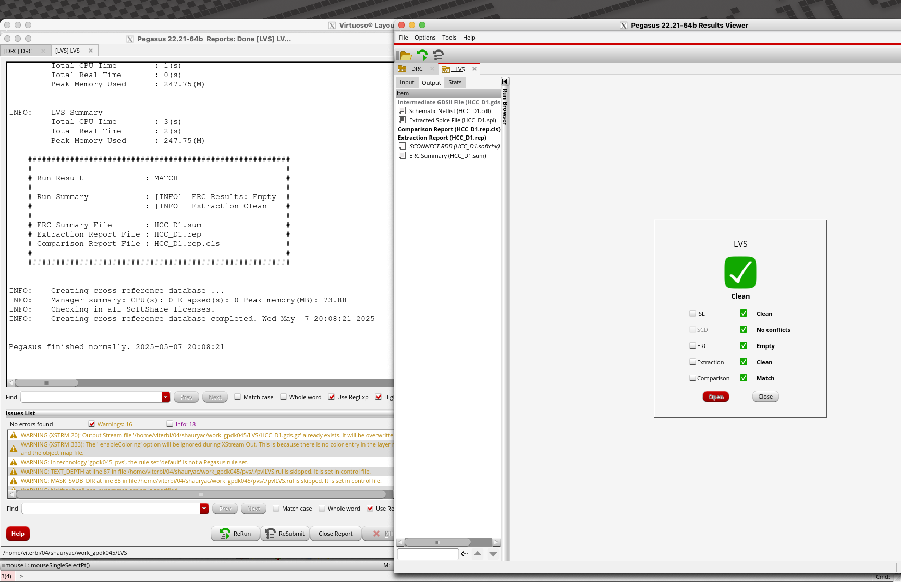

### Full‑Comparator Cell (FCC) Layout (Version 2)
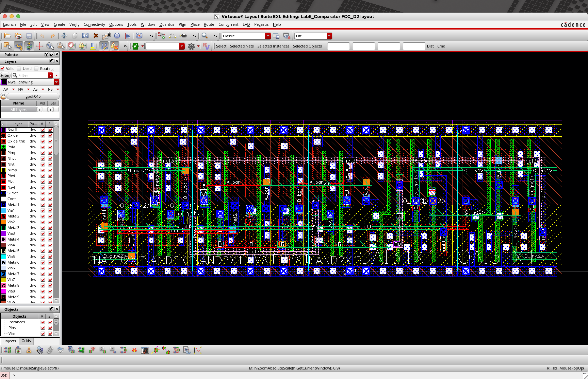
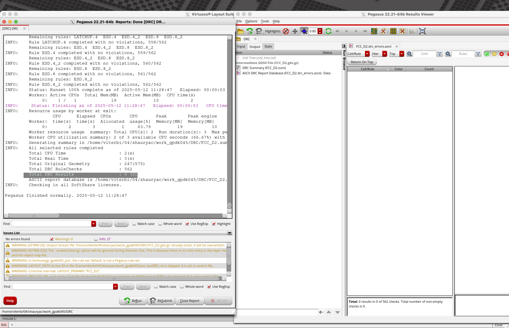
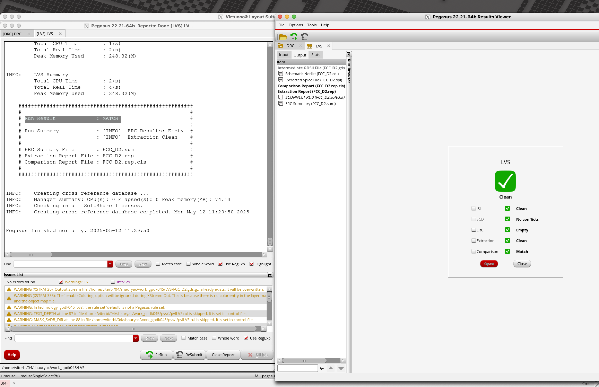

## Automatic Layout Generation using SKILL Script

```scheme
load("/home/viterbi/04/shauryac/work_gpdk045/SCRIPTS/myFunctions.il") ;<--your path

libName      = "Lab5_Comparator"      ; your lib
working_cell = "Comp_16bit_skill_test"
symViewName  = "layout"               ; view name  
hccName      = "HCC_D1"           
fccName      = "FCC_D2"
fccCellWidth = 5.6
prevInst     = nil

procedure(genCompArray(N)
    cell = working_cell
    lib = libName

    cvSch=dbOpenCellViewByType(lib cell "schematic" "schematic" "r")
    ; cvLay=lxGenFromSource(cvSch ?layViewName "layout" ?extractAfterGenerateAll t ?initCreateBoundary nil )
    cvLay=dbOpenCellViewByType(lib cell "layout" "maskLayout" "a")
    
    geOpen(?lib lib ?cell cell ?view "layout" ?mode "a")
    deInstallApp(getCurrentWindow() "Virtuoso XL")

    x_index = 0
    y_index = 0

    for( i 0 N-1
    ;; pick cell & instance name
    if( i == 0 then
      cellName = hccName
      instName = "HCC0"
      cellCreate(cellName, x_index, y_index, 0, 0)
      x_index = x_index - fccCellWidth
    else
      cellName = fccName
      instName = sprintf(nil "FCC%d" i)
      cellCreate(cellName, x_index, y_index, 0, 0)
      x_index = x_index - fccCellWidth
    )

    lxUpdateBinding(cvLay ?schCV cvSch)
    )
)
```

## 8-bit Comparator V2 Generated Layout

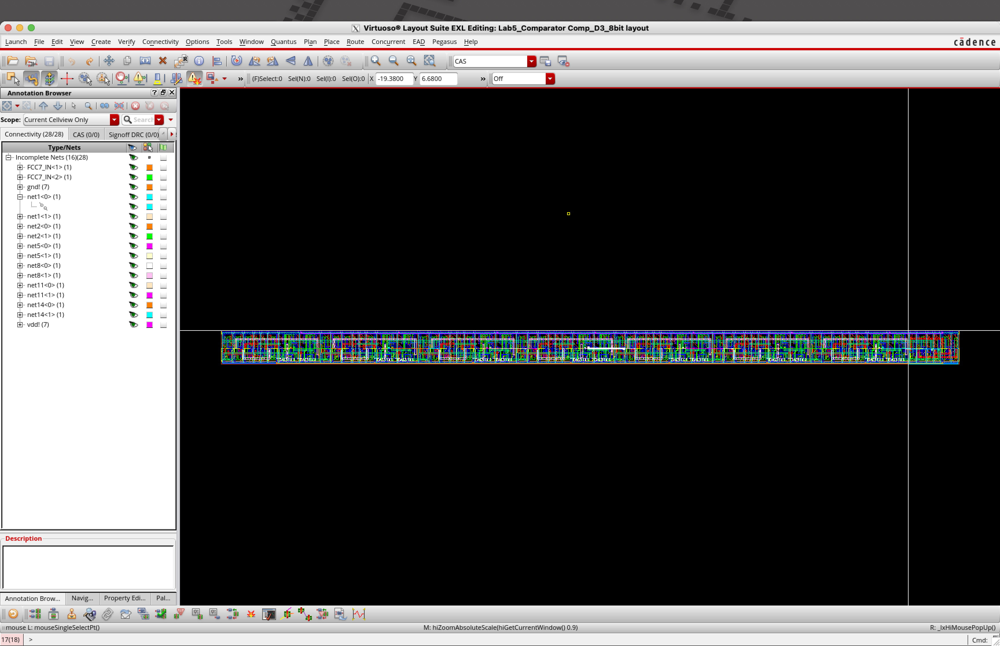
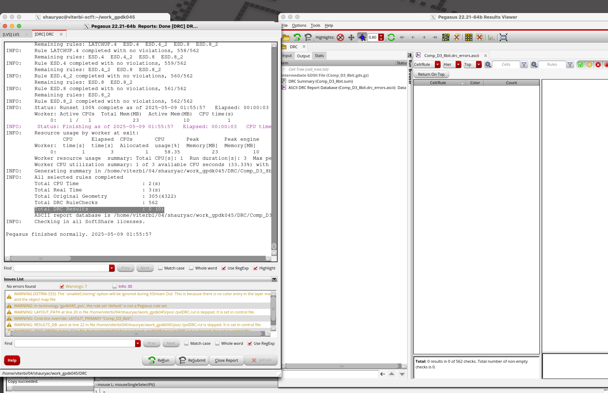
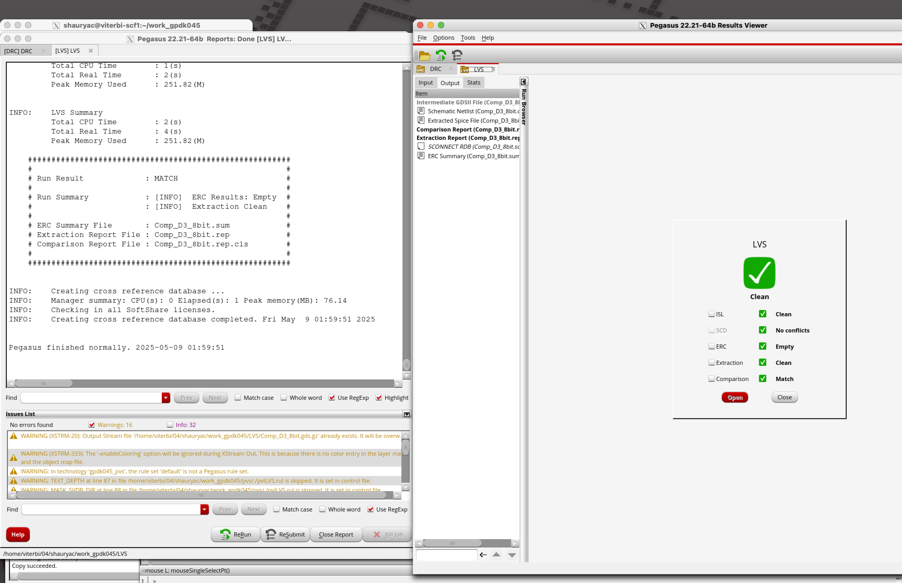

### 8-bit Comp Extracted Layout Simulation
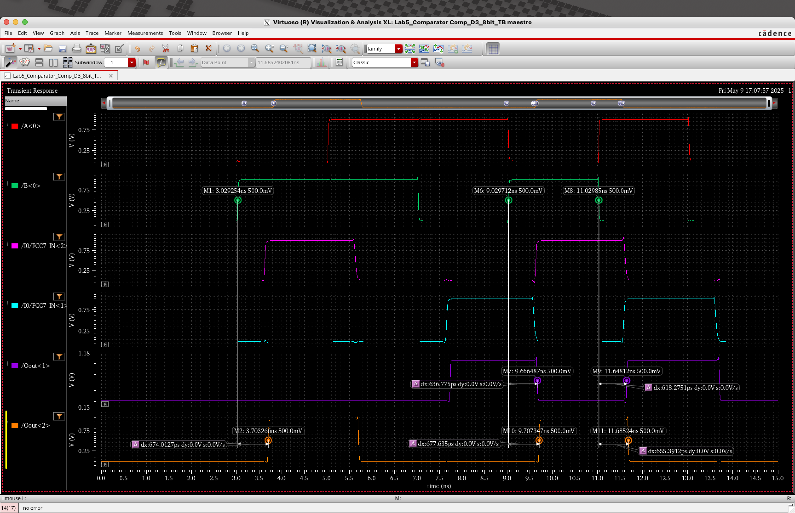

## 16-bit Comparator V2 Generated Layout

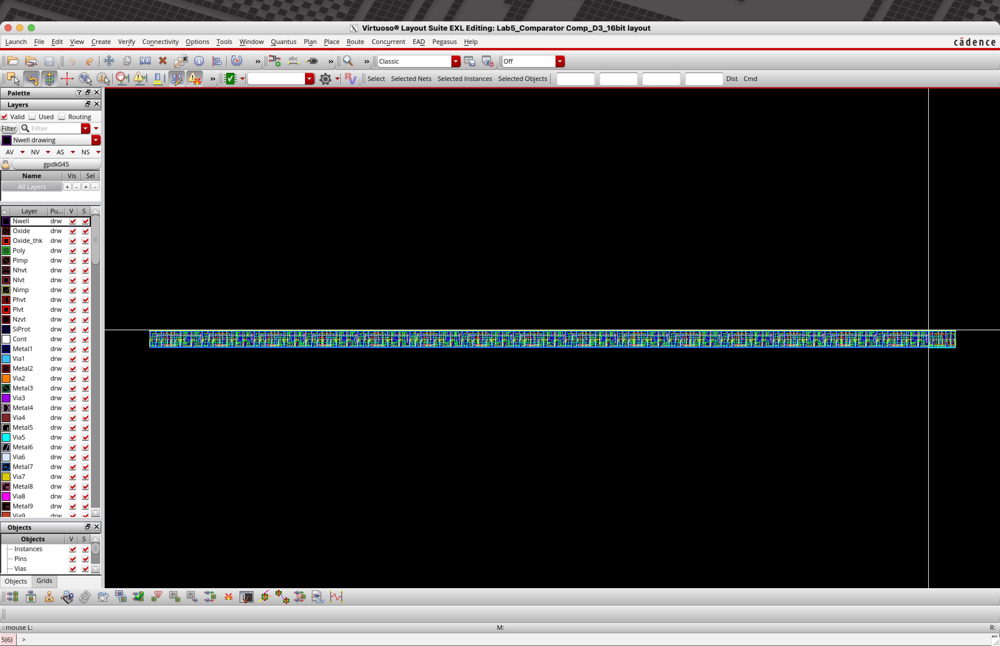
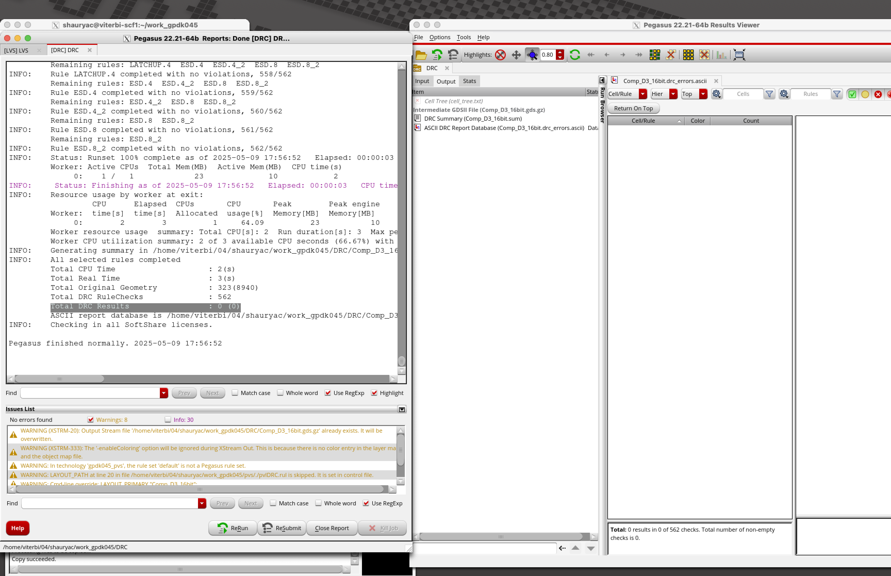


### 16-bit Comp Extracted Layout Simulation
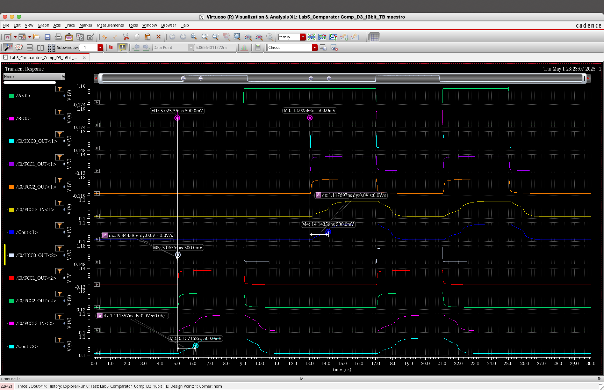

## Layout vs Schematic Delay Comparison

| Comparator |   Output  | Schematic Delay (ps) | Layout Delay (ps) |
| :--------: | :-------: | :------------------: | :---------------: |
|    8-bit   | O\_out<1> |        427.27        |       636.78      |
|    8-bit   | O\_out<2> |        384.29        |       677.64      |
|   16-bit   | O\_out<1> |        869.95        |        1117       |
|   16-bit   | O\_out<2> |        783.51        |        1111       |

